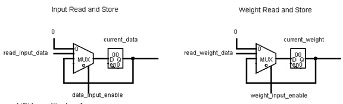
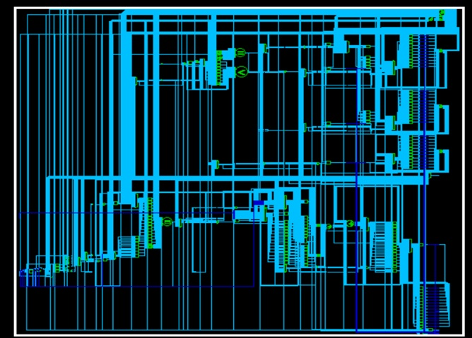

# HDL One Layer Neural Network
# An implementation of a multiplier accumulator to accelerate machine learning training

## Abstract

The use of hardware acceleration to train Deep Neural Networks is an approach that aims to reduce the great computer power that traditionally is used with other training forms such as GPUs and CPUs. The following report presents a design to calculate a one level network by implementing a Multiply Accumulator (MAC) and two 8-bit parallel multipliers as a hardware solution to train DNN’s. 

This approach intended to use the parallelism avaiable in FPGAs and ASICs. Additionally, this design considers the specifications given and taken them as feature for optimization. 

The achievement of this design is that it is a synthesizable design that runs at a clock speed twice as fast than given in the test bench thanks to the use of parallelism. The performance and the area has been optimized and the results are presented in this repository

# Table of Contents
1. [Introduction](#introduction)
    1. [Machine Learning and Artificial Neaural Network](#introsub1)
    2. [Mathematical Representation of an Artificial Neural Network](#introsub2)
    3. [Key specifications and Constraints](#introsub3)
    4. [Results](#introsub4)
2. [Micro-Architecture](#microarch)
    1. [Hardware algorithmic approach](#microarchsub1)
    2. [High Level Architecture and Schematics](#microarchsub2)
    3. [Synthesis with Design Vision](#microarchsub3)
3. [Interface Specification](#interfacespec)
    1. [One Layer Neural Network](#interfacespecsub1)
    2. [SRAM setup](#interfacespecsub2)
4. [Technical Implementation](#techimplementation)
5. [Tools Setup, Debug, and Verification](#debugver)
6. [Results Achieved](#desugnresults)
7. [Conclusions](conclusions)

## 1. Introduction 

### 1.1 Machine Learning and Artificial Neaural Network 

Machine Learning can be summarized as the extraction of features from data in order to solve predictive problems and implement and train a model with these features. A trained model can recognize complex patterns and make the best decision based on the features extracted from the data. Models need to be trained, tested, and calibrated to detect these patterns using data before they can be used.

Artificial Neural Network (ANN) is an approach of Machine Learning inspired by the neural networks in biological systems. These algorithms are modeled based on a collection of connected perceptions as in a biological brain and can be seen in Figure 1. These networks “learn” to perform tasks through a training process. During the training process, the associated weights of each connection can be adjusted to better match the desired result as training proceeds

|  | 
|:--:| 
| *Neuron and Perceptron* |

### 1.2 Mathematical Representation of an Artificial Neural Network 

A connection of perceptions, which include inputs and weights, can be represented as a matrix and the training can be implemented with matrix multiplication as seen in Figure 2. The weight affects the strength of the connection between the network, with greater weight magnitudes meaning that the connection has more influence in the result. This is where the presented hardware design comes in as an implementation of the training algorithms for a one-layer artificial neural network.

|  | 
|:--:| 
| *Neural Network and Matrix Equivalent* |

### 1.3 Key specifications and Constraints 

This design is focused on achieving a solution given the following specifications:
-	Be able to receive 2-bit weights, 8-bit inputs, 16-bit outputs, and up to 64 inputs 
-	Be able to interact with SRAM’s to read data and weight values
-	Be able to write to an SRAM the output values
-	Be able to work with the test fixture given which verifies results

### 1.4 Results 

The final result is a one-layer Artificial Neural Network MAC that can meet slack with a clock up to 4.2ns, which is more than twice faster than the frequency given in the test bench. Additionally, the design counts with a final area of 1996.198 um -2. This design completes the required files in 3266 cycles. The performance, Area*number of cycles * clock period, ends up at 0.0643 using a clock of 10 ns of 0.02958 using a clock of 4.6 ns.

Furthermore, there will be an explanation of the Micro-Architecture design, the understanding and designing an interface specification, the technical implementations, and the verifications will be discussed in the following sections

## 2. Micro-Architecture 

### 2.1 Hardware algorithmic approach 

The addition of a continuous multiplication takes advantage of the clock time and parallelism available in hardware as seen in Figure 3. The current design implements a MAC with two parallel input and weight multipliers using the design constraints as feature for faster summation.

Summation to obtain Hyperparameter with proposed design

### 2.2 High Level Architecture and Schematics 

The described hardware algorithm is composed of one MAC (Figure 4). Additional data paths for this design are selector lines to read from the input and weight SRAMs (Figure 5), selector lines to write to the output SRAM, two counters for multiplication and convolutions (Figure 6), a flip flop to collect the number of inputs to read, a flip flop to set a reference address.

Data and Weight Selection, and Multiplier Accumulator

Input and Weight Mux for Register Control

Convolution and Multiplication Counter

Additional important features of the presented design are that it only uses one clock to run the design to avoid different time domain conversion, one edge to activate the control path, and only flip flops to avoid any unwanted latches and prevent hold violations

### 2.3 Synthesis with Design Vision 

The synthesis was done with Design Vision. Commands were used to setup the design, add constraints, compile, loop to perform the fastest clock, and provide with specifications and reports of the design. The importance of this process can be seen in the reduction of area by comparing the original design (Figure 7) and the optimized design (Figure 8)

Figure 7: Pre-optimized Design MyDesign for 1-layer ANN

Figure 8: Post-optimized Design MyDesign for 1-layer ANN

## 3. Interface Specification 

### 3.1 One Layer Neural Network 
The control interface between the design, the two input SRAM’s and one output SRAM can be seen in Table 1. The designed input output diagram can be seen in Figure 9 and synthesized version can be seen in Figure 10. A timing diagram with the interface lines for the first states can be seen in Figure 11.

Figure 9: Designed IO Diagram

Figure 10: Synthesized IO Diagram

| Definition: | Description: |
| --- | ----------- |
| input reset | Active low reset signal, will clear the machine state |
| input clk | System clock forwarded from the test fixture. |
| output busy | The test bench will halt when busy is high, waiting for the computation. |
| input run | The test bench will set run signal high after all data has been loaded |
| output	write_enable | Enables writing to SRAM with results |
| output [11:0] write_address | Provides with the address to SRAM to write results. |
| output [15:0] write_data | Provides with the data to SRAM to write results. |
| output [11:0] ram_read_address | Provides with the address to SRAM with data inputs. |
| output [15:0] wmen_read_address | Provides address to SRAM with weight values. |
| input [15:0] sram_read_data | Receives data from SRAM with data inputs |
| input [15:0] wmen_read_data | Receives data from SRAM with weight inputs |

Table 1: Signals, Width and Function

Figure 11: Timing Diagram with Interface Lines Selected

###  3.2 SRAM Setup 

SRAMs are organized as 16-bit wide word addressable random access synchronous memories.Can be written to and read from at one location per clock cycle.Two ports : one read, one write

<table>
  <tr style="text-align:center">
    <td>SRAM IO</td>
     <td>SRAM Timing Diagram</td>
  </tr>
  <tr>
    <td></td>
    <td></td>
  </tr>
  <tr style="text-align:center">
    <td>Input and Output SRAM in test fixture</td>
    <td>Timing Diagram and for SRAM in test fixture</td>
  </tr>
 </table>

## 4. Technical Implementation 

The design has a defined difference between data path, described in microarchitecture, and control path. The control path considers the interaction between the SRAMs, the setup of values for the current run, a control for MAC, a state for transition to next set of inputs, and an ending state. This control path can be seen in the FSM and can be seen in Figure 12.

Figure 12: Finite State Machine of Control Path

## 5. Tools Setup, Debug, and Verification 

The softwares used for this project were [VS Code](https://code.visualstudio.com/download) as code editor and added a Verilog-HDL Extension, [Mentor Graphics Modelsim Student Version](https://www.mentor.com/company/higher_ed/modelsim-student-edition) for simulation and Synopsys Design Vision Compiler enviroment for synthesis.

Different tools were used to debug and verify the design. The first method used was to hand draw the data paths needed for this design. This will help in debugging behavior that was wrongly coded. Also, a hand drawn timing diagram was used to compare to the simulated diagram given by the test bench from Modelsim. 

The main verification method was timing diagrams where it can be seen what is received from the SRAMs, what is the selection, multiplication, and accumulation outputs, and also the activation and deactivation of multiplexers that control registers by their enabling signal which can be seen in Figure 11.
 
A final report of the run was given when the test bench was properly simulated. An output of a proper run can be seen in Figure 13.

Figure 13: Transcript Returned by the Test Bench

## 6. Design Results 

The final results of the design like the final area, total cells, delay, and other information can be seen in Table 2. The full results are in the attached documents with the report.

| Description: | Amount: |
| --- | ----------- |
| Total cell area: | Ac1969.198011 um-2 |
| Total cells: | 1315 cells |
| Slack MET for minimum delay | 0.0402 us |
| Slack MET for maximum slow delay for a 4.6 ns clock | 0.0001 us |
| Delays: | Input_0: 1639 Input_1: 1541 |
| Number of Cycles  | 3266 cycles |
| 1/(delay.area) (ns-1.um-2) | 1/(32660*1969.198) = 1.555*10^-8(ns-1.um-2) |

Table 2: Final Results Summary

## 7. Conclusions 

With the need of more efficient forms of training ANN’s for specific parameters, a focused design in an FPGA and later an ASIC most likely will outperform CPUs and even GPUs. The presented design helps in the process of training a 1 level ANN with certain parameters specified. The approach can be summarized as implementing an ANN algorithm by using a MAC that dynamically retrieves information from SRAMs and stores the accumulated output in another SRAM. 

The result is a synthesizable design that has no latches, with the minimum amount of area and with the capacity to run at higher frequencies that established in the test bench. This project has been very interesting and relevant to the current fields in Computer Engineering
